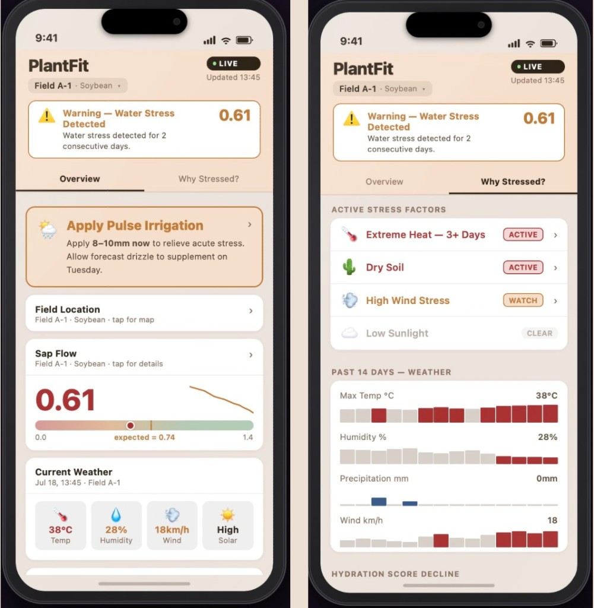

# Illini Popcorn: PlantFit

**Event:** Precision Digital Agriculture Hackathon 2026 

**Track:** Smart Crops 

**Theme:** Plant Water Stress and Precision Irrigation

**Team Member**

Ximin Pian - xpiao2@illinois.edu, UIUC, (PhD candidate in CEE)

Priyal Maniar - priyalm2@illinois.edu, UIUC, (MSIM’26 Grad Student)

Prisha Singhania - pds4@illinois.edu, UIUC, (MSIM’26 Grad Student)

Yuyang Liu - yuyang19@illinois.edu, UIUC, (MSIM’27 Grad Student)

**Problem Statement:** Crops are thirsty and we often know too late. This causes great loss in productivity. We integrate a minimum invasive crop sap flow sensor to see the “pulse of the crop” and combine it with environmental data and forecasts to provide irrigation advice.

**PlantFit** is a data-driven crop management system designed to optimize irrigation schedules using real-time weather data, plant sap flow data,time series forecasting and predictive modeling. This project integrates atmospheric forecasts with plant-specific metrics to ensure efficient water usage and optimal growth for crops.

**Slides link**
[View Presentation](https://www.canva.com/design/DAHDUa_mb_k/wt2sLgOy3A5au5aAAXjsIw/view?utm_content=DAHDUa_mb_k&utm_campaign=designshare&utm_medium=link2&utm_source=uniquelinks&utlId=h92986a0da3)


##  Key Features

- **Automated Irrigation Modeling:** Execute core agricultural logic via `run_irrigation_model.py` to calculate precise watering needs.
    
- **Weather Integration:** Processes 48-hour forecasts and historical precipitation data to adjust for upcoming environmental changes.
    
- **Zone Management:** Modular control for different field sectors, allowing for specialized treatment based on soil type or crop stage.
    
- **Baseline Calibration:** Utilizes a `trained_baseline.csv` to compare current field data against historical performance standards.
    
- **Visual Prototyping:** Includes an interactive interface (`plantfit_prototype.html`) for monitoring plant health and making insights easy for farmers to understand—encouraging adoption and improving awareness of crop health.

<p align="center">
  
</p>

## Data Sources

This project integrates diverse agricultural, meteorological, and geospatial datasets for Bondville, Illinois:

- **Satellite Imagery (NDVI):** Sentinel-2 Level-2A satellite imagery sourced via the Copernicus Browser, used to monitor vegetation health and density.
- **Weather Data:** Environmental Conditions data from the [NOAA SURFRAD Network (Bondville Station)](https://gml.noaa.gov/grad/surfrad/bondvill.html).
- **Precipitation Data:** Historical precipitation metrics from the [Illinois Water and Atmospheric Resources Monitoring (WARM) Program](https://warm.isws.illinois.edu/warm/datatype.asp).
- **Evapotranspiration (ET) Data:** Pulled via the **OpenET API** to measure water movement from the soil and plants into the atmosphere.
- **IoT Sensor Data (Simulated):** Represents readings from 2 sensors per plant (capturing 4 distinct data points each). To model the July–August yield window, this dataset was synthetically generated using seasonal variation patterns and time series forecasting. 
    * *Note: While currently using modeled data for the prototype, the pipeline is designed to ingest live, real-world sensor data to drive accurate, real-time predictions in deployment.*

 ##  Data Pipeline

- **Zone delineation from satellite NDVI (Bondville, IL)**: Pulled past 5 years of Sentinel-2 NDVI imagery for Bondville and computed a 5-year moving average to classify yield zones as **High / Medium / Low**.
- **Sensor placement strategy for 2026**: Used the yield zones to define a scalable deployment strategy (allocate **more sensors to High Yield zones** and **fewer sensors to Low Yield zones**) to optimize cost and coverage.
- **Field-level physiological + environmental data (July–Sept 2025)**:
  - **Plant sap flow sensor readings** (analysis used private real-world data; the repo publishes a synthetic version)
  - **Weather/environmental drivers** (temperature, relative humidity, wind, solar)
  - **Precipitation** (historical daily totals)
  - **Evapotranspiration (ET)** via OpenET API to estimate baseline water demand for the field
- **Normalized Sap Flow Index (NSFI)**: Combined sap flow with environmental water demand to produce a normalized signal used for stress inference.
- **7-day calibration baseline**: Established a baseline (7-day window) for expected sap flow behavior by time-of-day.
- **Stress alerting**: Computed a **4-hour rolling average** of normalized sap flow and triggered water-stress alerts when the rolling average drops below the calibrated baseline threshold.
- **Machine learning (forecasting)**: Trained a **Random Forest regressor** on historical data to predict sap flow under forecasted environmental conditions and generate **next-48-hour stress outlooks**.

**Outputs**

- **Real-time plant water stress alerts**
- **Forecast-based irrigation recommendations**
- **Environmental stress explanations** (rainfall + ET + forecast-driven demand context)
- **Zone-level crop monitoring** (High/Medium/Low yield zones and sensor allocation)
<p align="center">
  
</p>

---


##  Repository Structure

|**File / Folder**|**Function**|
|---|---|
|`data/`|Datasets used by the pipeline (weather, precipitation, sap).|
|`data/sap/raw/`|Raw (simulated) sensor inputs (`sensor1.csv`, `sensor2.csv`) and preprocessing notebook inputs.|
|`outputs/`|Generated artifacts (trained model, baseline, forecasts, maps).|
|`prototype/`|Web-based dashboard prototype (`plantfit_prototype.html`) and demo video.|
|`scripts/`|Execution scripts and preprocessing utilities.|
|`Dockerfile`|Container image definition for consistent runs.|
|`docker-compose.yml`|One-command Docker run with data/outputs mounted.|
|`.gitattributes`|Git configuration (includes Git LFS patterns).|
|`.gitignore`|Specifies intentionally untracked files to ignore.|
|`README.md`|Project overview and usage instructions.|
|`requirements.txt`|Python dependencies required for the system.|

---

##  Installation & Setup

### Prerequisites

- Python 3.8+
    
- Pip (Python package manager)

### Docker (recommended)

This repo includes a `Dockerfile` and `docker-compose.yml` so the pipeline runs consistently across machines.

1. **Install Docker Desktop**
2. **Build + run**

```
docker compose up --build
```

This will run `scripts/irrigation_model.py`. Generated artifacts are written to `outputs/` on your machine via a volume mount.

#### Optional: OpenET API key

```
export OPENET_API_KEY="YOUR_KEY"
docker compose up --build
```
    

### Installation

1. **Clone the repository:**
    
    Bash
    
    ```
    git clone https://github.com/PriyalManiar/illini_popcorn.git
    cd illini_popcorn
    ```
    
2. **Install dependencies:**
    
    Bash
    
    ```
    pip install -r requirements.txt
    ```

3. **External API**
    API key was originally stored in the .env file but have also include it in the api_key file

---

##  Usage

The system is designed to be modular, allowing for both automated modeling and manual data adjustment.

### Running the Irrigation Model

To generate irrigation recommendations based on current forecasts and crop baselines, run the primary script:

Bash

```
python scripts/irrigation_model.py
```

### Data Customization

- **Forecast Adjustments:** You can manually update `mock_48hr_forecast.csv` with specific temperature or humidity data to simulate different environmental stress tests.
    
- **Model Calibration:** The `trained_baseline.csv` file serves as the ground truth for "healthy" crop behavior. Updating this allows the model to adapt to different corn hybrids.
    

### Web-based Dashboard Prototype

To view the conceptual UI for this system, open `plantfit_prototype.html` in any web browser. This dashboard provides a visual representation of soil moisture levels and plant health trends.

---

## 📄 License

This project is licensed under the **MIT License**
